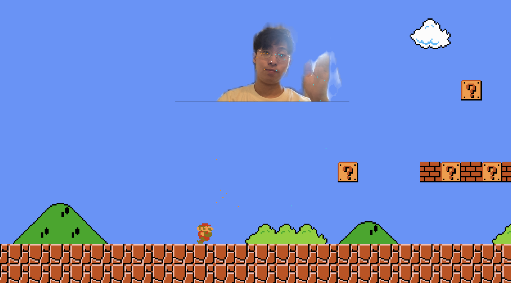

# MotionMario
Welcome to MotionMario, the revolutionary gaming experience that brings your physical movements and voice commands into the world of Mario! Get ready to jump, run, and stomp your way to victory using nothing but your body and voice.



## How It Works

**Motion Controls**: Connect your preferred motion sensor device, such as a Kinect or PlayStation Camera, to your gaming setup. MotionMario uses this technology to track your movements in real-time, allowing you to control Mario's actions by simply moving your body. Run in place to make Mario run, jump to make him jump, and crouch to make him slide!


**Voice Commands**: MotionMario takes voice control to the next level. With the help of your microphone, you can activate special abilities and perform moves by speaking commands out loud. Want to make Mario perform a super jump? Just say the magic word! The game recognizes a wide range of voice commands, adding a whole new layer of interactivity and immersion.


## Project Installation
1. Open `PoseMario.scene`
2. Download MediaPipe Unity Plugin [Download](https://github.com/homuler/MediaPipeUnityPlugin/releases/download/v0.12.0/MediaPipeUnity.0.12.0.unitypackage)
3. Drag and Drop the Unity Editor to install the plugin package 
4. Add `MotionProxy.GetInstance().SetPoseLandmark(eventArgs.value);` into `OnPoseLandmarksOutput` method in `PoseTrackingSolution.cs`
```csharp
private void OnPoseLandmarksOutput(object stream, OutputEventArgs<NormalizedLandmarkList> eventArgs)
{
    MotionProxy.GetInstance().SetPoseLandmark(eventArgs.value);
    _poseLandmarksAnnotationController.DrawLater(eventArgs.value);
}
```
5. Done!

## Disclaimer
The original mario project in this [zigurous/unity-super-mario-tutorial](https://github.com/zigurous/unity-super-mario-tutorial) repository.


